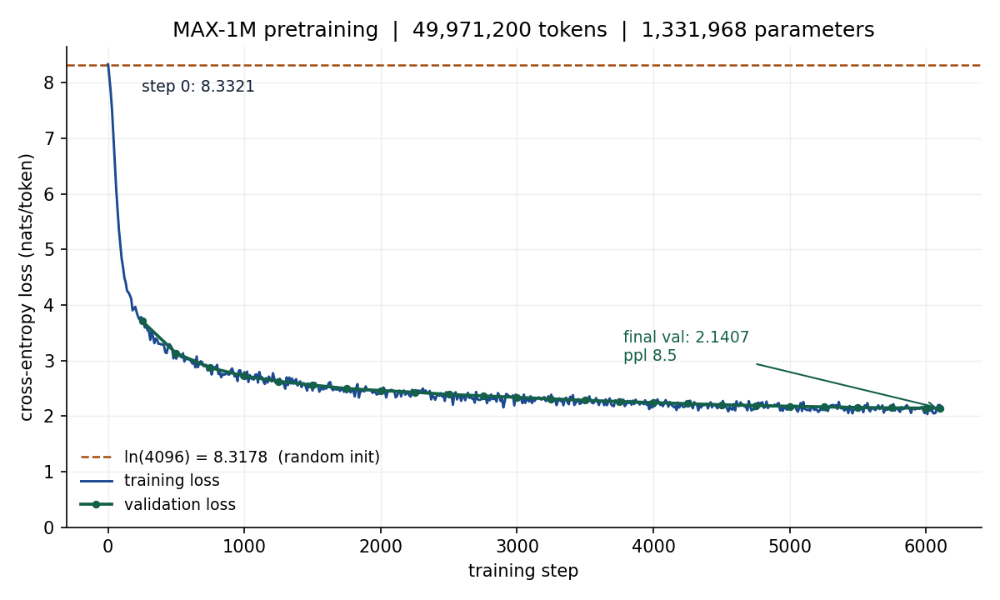

# MAX — Multi-Agent Explainable AI with Collaborative Neural Reasoning

A decoder-only Transformer language model **implemented from scratch and trained from random
initialisation** — no pretrained weights, no fine-tuning, no API model — which will be specialised
into five collaborating reasoning agents.

> **Review 1 milestone: complete.** A 1,331,968-parameter language model was built, randomly
> initialised, trained on ~50 million tokens, validated, checkpointed, reloaded in a fresh process
> and used to generate text.

---

## Results

Run `run_a_001` · Tesla T4 (free Google Colab) · seed 1337 · **all values measured, none estimated**

| Metric | Value |
|---|---:|
| Parameters | **1,331,968** |
| Step-0 loss | **8.33214** — compare `ln(4096) = 8.3178` |
| Final training loss | 2.194813 |
| **Final validation loss** | **2.1407** |
| Perplexity | 8.5053 |
| Bits per token | 3.0884 |
| Next-token accuracy@1 | 51.10% |
| Checkpoint reload difference | **0.000000** |
| Training time | 2.6 min · 6,100 steps · 49,971,200 tokens |
| Throughput | 320,128 tokens/s |
| Peak VRAM | 0.83 GB of 15.4 GB |



The dashed line is `ln(4096) = 8.3178` — where a randomly initialised model over a 4,096-token
vocabulary *must* start. Training and validation stay on top of each other for the whole run: no gap,
no overfitting.

### Generated text

Loaded in a fresh process from the saved checkpoint, temperature 0.2:

> *"The little girl was so happy that she had made a new friend. She was so happy that she could
> help her friend. She hugged her…"*

Grammatical sentences with correct pronoun agreement from 1.33M parameters trained for 2.6 minutes.
This is narrative English on a restricted vocabulary — **not** general language competence, and the
model cannot answer questions. Reasoning training is the next milestone.

---

## The from-scratch claim, and how it is verified

Four independent checks, all automated:

**1 — Step-0 loss equals ln(vocabulary).** A model that has learned nothing spreads probability
evenly over the vocabulary, so its cross-entropy is exactly `ln(V)`. Ours measured **8.33214**
against `ln(4096) = 8.3178`. A model carrying pretrained weights starts far below this.

```bash
python scripts/04_verify_model.py
```

**2 — No pretrained-loading call exists anywhere in the source.**

```bash
pytest tests/test_no_pretrained.py -v
```

Fails the build if `from_pretrained`, `AutoModel`, `hf_hub_download`, `snapshot_download` or
`torch.hub.load` appears in any `.py`, `.yaml` or `.ipynb` file — and if `transformers` is ever
added to `requirements.txt`. `datasets` is a dependency because it downloads **data**; nothing here
downloads a **model**.

**3 — The checkpoint is portable.** Reloaded in a process that trained nothing, it reproduced its
validation loss with a difference of `0.000000`.

**4 — Targets are correctly aligned.** Because the LM head is tied to the token embedding, an
off-by-one in the training targets would make step-0 loss land near 7.30 instead of 8.33 — so the
`ln(V)` check also proves the training objective is wired correctly. Asserted in
`tests/test_training.py`.

**119 tests pass.** `pytest tests/ -q`

---

## Model

| Setting | Value | Reason |
|---|---:|---|
| Vocabulary | 4,096 | Fits a simple corpus without the embedding dominating the model |
| Embedding dim | 128 | Internal representation width |
| Layers | 4 | Depth to compose meaning across positions |
| Attention heads | 4 | 128 ÷ 4 = 32 dims per head |
| FFN dim | 512 | 4 × d_model, the conventional ratio |
| Context length | 128 | Covers a whole short story |
| Positional encoding | learned absolute | Simplest correct choice; RoPE planned for the larger model |
| Normalisation | pre-LN | Trains reliably without a hand-tuned warmup |
| Activation | GELU | Keeps the parameter arithmetic simple |
| LM head | tied to embedding | Saves 524,288 parameters (39% of the total) |

```
token embedding      4,096 × 128                        =   524,288
positional embedding   128 × 128                        =    16,384

per transformer block
  attention   W_q, W_k, W_v, W_o   4 × (128 × 128)      =    65,536
  2 layernorms                     2 × (2 × 128)        =       512
  feed-forward  128×512 + 512  +  512×128 + 128         =   131,712
  ----------------------------------------------------------------
  one block                                             =   197,760
  × 4 layers                                            =   791,040

final layernorm            2 × 128                      =       256
LM head                    tied to embedding            =         0
==================================================================
TOTAL                                                     1,331,968
```

`tests/test_config.py` recomputes this from `configs/model_a.yaml` and asserts it equals 1,331,968.

---

## Tokenizer

Our own byte-pair-encoding implementation (Sennrich et al., 2016), fitted on the **training split
only** — fitting on the whole corpus would leak validation statistics into the vocabulary.

| Property | Value |
|---|---:|
| Vocabulary | 4,096 |
| Merges learned | 3,966 |
| Character alphabet | 98 |
| Round-trip accuracy | 1000 / 1000 (100%) |
| `<\|unk\|>` rate | 0.0000% |
| Compression | 3.88 chars/token |
| Fingerprint | `d6080bac0a9a` |

The fingerprint is stored inside every checkpoint. Loading a checkpoint against a re-fitted
tokenizer produces fluent nonsense with no error message, so the loader **refuses on mismatch**
rather than warning.

IDs 0–31 are reserved before any merge is learned — `<|pad|>`, `<|bos|>`, `<|eos|>`, `<|unk|>`, plus
`<|solver|>`, `<|critic|>`, `<|verifier|>`, `<|alternative|>` and the reasoning-schema field tokens
for later milestones. Adding a token after training means inserting an untrained row into a trained
embedding table.

---

## Dataset

| | |
|---|---|
| Corpus | [TinyStories](https://huggingface.co/datasets/roneneldan/TinyStories) |
| License | CDLA-Sharing-1.0 |
| Documents loaded | 230,000 |
| After cleaning and deduplication | 226,654 |
| Characters | 204,352,155 |
| Split | 98 / 1 / 1 (seeded) |
| Tokens | 51,601,430 train · 527,038 validation · 522,122 test |

TinyStories is used because Eldan & Li (2023) showed that models in the 1–30M parameter range
produce fluent English on it. At this scale, general-purpose corpora produce gibberish.

Two ordering decisions worth noting: deduplication happens **before** the split, so a near-duplicate
cannot straddle train and validation; and the tokenizer is fitted **after** the split, on train only.

---

## Quickstart

```bash
pip install -r requirements.txt
pytest tests/ -q                                   # 119 tests

# exercise the whole pipeline in ~6 seconds on a 1 MB public-domain corpus
python scripts/01_prepare_corpus.py --source smoke
python scripts/02_train_tokenizer.py
python scripts/03_encode_corpus.py
python scripts/04_verify_model.py
```

Full run (needs HuggingFace access — Colab or Kaggle):

```bash
python scripts/01_prepare_corpus.py --source tinystories
python scripts/02_train_tokenizer.py
python scripts/03_encode_corpus.py

python scripts/04_verify_model.py                  # gate: step-0 loss = ln(4096)
python scripts/05_overfit_batch.py                 # gate: loss < 0.1 on 8 fixed sequences
python scripts/06_lr_probe.py                      # 3 × 200 steps, pick the best stable LR
python scripts/07_train.py --lr 3e-3 --checkpoint-dir <drive>/checkpoints

python scripts/08_evaluate.py  --checkpoint <drive>/checkpoints/ckpt_A_final.pt
python scripts/09_agent_stub.py --checkpoint <drive>/checkpoints/ckpt_A_final.pt
```

If the runtime is preempted, `python scripts/07_train.py --resume` picks up **bit-exactly** — batch
windows for step *N* are drawn from a generator seeded on `(seed, N)`, so a resumed run sees the
same data the original would have. Asserted by `test_resume_is_bit_exact`.

---

## Repository layout

```
configs/          YAML — data, tokenizer, model_a, train_a
tokenizer/        our BPE trainer, encoder/decoder, special-token registry
model/            attention.py · block.py · transformer.py · init.py
training/         data.py · optim.py · checkpoint.py · trainer.py
reasoning/        role output schema + tolerant parser
agents/           RoleAgent, V0 protocol (solver → critic → verifier → vote)
explainability/   decision record + ASCII decision graph
evaluation/       level1 metrics, loss-curve plotting
scripts/          01–09, run in order
results/          run manifests, metrics.csv, samples, plots
docs/             study guide, presentation, full project blueprint
tests/            119 tests, including the no-pretrained-weights guard
```

Two rules enforced throughout: **no file over ~300 lines**, and **every run writes a manifest**
recording seed, config, config hash, dataset revision, tokenizer fingerprint, git commit and
hardware.

---

## Roadmap

| Milestone | Scope | Status |
|---|---|---|
| **Review 1** | Build and train our own LLM from scratch | ✅ complete |
| Review 2 | Scale to 13.8M parameters + reasoning training | next |
| Review 3 | Five agents: Solver, Critic, Verifier, Alternative Reasoner, Coordinator | planned |
| Review 4 | Collaborative neural reasoning, explainability, calibration, evaluation | planned |

Every later milestone uses this same checkpoint — nothing above is rebuilt.

**Research question:** can multiple specialised agents built on a model trained from scratch improve
reasoning accuracy, reliability and explainability over a single agent, at a matched inference
budget? Because the corpus and the benchmark are both generated by us, no test item can have
appeared in pretraining — a contamination guarantee that work built on downloaded models cannot make.

---

## Current limitations

Stated plainly, because every one of them follows from a deliberate scope decision:

- **1.33M parameters.** Output is simple narrative English on a restricted vocabulary.
- **Cannot answer questions.** Trained only to continue text; reasoning training is Review 2.
- **Phrase-level repetition** is visible in samples. Measured immediate word-repetition is 0.0011,
  but that metric does not capture phrase looping.
- **128-token context**, single domain, single training run — run-to-run variance not yet measured.

---

## Documentation

- [`docs/Review1_StudyGuide.pdf`](docs/Review1_StudyGuide.pdf) — 41-page technical guide covering the
  full pipeline, Transformer internals, training, and 42 viva questions
- [`docs/Review1_Presentation.pptx`](docs/Review1_Presentation.pptx) — 22-slide review presentation
- [`docs/PROJECT_BLUEPRINT.md`](docs/PROJECT_BLUEPRINT.md) — complete technical analysis and roadmap
  through Review 4

## References

- Vaswani et al. (2017), *Attention Is All You Need*
- Radford et al. (2018, 2019), the GPT decoder-only architecture and initialisation recipe
- Sennrich et al. (2016), *Neural Machine Translation of Rare Words with Subword Units* (BPE)
- Eldan & Li (2023), *TinyStories: How Small Can Language Models Be and Still Speak Coherent English?*

## License

Code released under the MIT License — see [LICENSE](LICENSE).
The TinyStories dataset is licensed CDLA-Sharing-1.0 by its authors and is not redistributed here.
